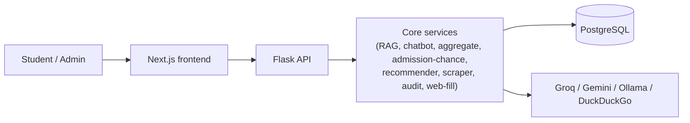

# UniVoice — AI Admission Assistant for Pakistan

An AI platform that helps students choose a university and degree program, grounded
in a **self-built, self-verifying dataset** of Pakistani universities.

The hard part of this project is not the chatbot. It is that **no accurate,
structured dataset of Pakistani university programs and fees exists**, and the
source websites are a mess (JavaScript sites, ASP.NET postbacks, scanned-PDF fee
tables, hidden fees, multiple campuses). The core contribution is an **autonomous,
search-first, self-correcting, self-auditing data-acquisition pipeline** that builds
that dataset from scratch with no per-site rules. The chatbot, semantic search,
admission-aggregate engine, admission-chance predictor and recommender are the
application layer on top.

---

## Headline results (measured)
- **~93% catalogue coverage** with the search-first scraper vs **~38%** for a naive
  full-site crawl.
- **~2,277 programs across 20 universities**; fees filled to **~60%** (official sites
  + free web estimates), with genuine non-publishers marked *"official fee structure
  not available"*.
- **Semantic retrieval lifts Precision@10 from 0.65 (keyword) to 0.91 (vector)** and
  MRR from 0.69 to 0.86; the chatbot never invents a fee.
- Filling fees + admission deadlines for every university cost **$0** on the paid API.

---

## Table of contents
1. [Features — what, how, and why](#features--what-how-and-why)
2. [Key techniques and the reasoning behind them](#key-techniques-and-the-reasoning-behind-them)
3. [Methodology & the math](#methodology--the-math)
4. [Evaluation (measured results)](#evaluation-measured-results)
5. [Architecture](#architecture)
6. [Data model](#data-model)
7. [Tech stack (and why)](#tech-stack-and-why)
8. [Security](#security)
9. [Run it](#run-it)
10. [Project layout](#project-layout)

---

## Features — what, how, and why

Each feature lists **what it does**, the **tool/technique** it uses, and **why**.

### 1. Search-first, self-correcting scraper
- **What:** Turns any university website into a clean list of degree programs + fees,
  with no per-site rules.
- **How:** Instead of crawling hundreds of pages, it **searches first** (DuckDuckGo /
  Tavily / Google grounding) for the few authoritative pages — the program list and
  the fee-structure page — then fetches each in **tiers**: plain `requests` →
  **Selenium headless Chrome** for JS-rendered pages → **pdfplumber** (and Gemini
  vision) for PDFs. An LLM extracts each program into a fixed JSON schema. A
  **self-correction** step web-searches the expected program count and *deepens* the
  crawl when coverage looks short.
- **Why:** A handful of authoritative pages beat a 300-page crawl for accuracy and
  cost; the tiered fetch is the only reliable way to read the wildly different PK
  university stacks; self-correction fixes the "we only found 26 of 102 programs"
  failure mode (proven on Air University: 26 → 102).

### 2. Self-audit (accuracy layer)
- **What:** After every scrape the system checks its own output instead of trusting it.
- **How:** Deterministic anomaly rules (fee out of range, per-degree fee outliers,
  junk/enumeration/nav names, fuzzy duplicates via **rapidfuzz**) + optional
  **official-PDF reconciliation** + an optional **LLM-as-judge** (Gemini) that
  *critiques* the list (it never supplies numbers). Doubtful rows go to a human
  **review queue**.
- **Why:** The scraper is ~55% accurate on a hard site; a verification layer that
  estimates its own reliability and surfaces the weak parts is what makes the data
  trustworthy. Never letting an LLM *invent* a number keeps hallucinated fees out.

### 3. Confidence-gated auto-clean
- **What:** Automatically removes obvious junk (course "electives", nav text scraped as
  programs) and redundant duplicates.
- **How:** A record is deleted **only** when its `scrape_confidence < 0.5` **AND** it is
  a junk-named record or a redundant duplicate copy (best copy always kept).
- **Why:** The confidence gate is the safety net — real programs score ~0.85 and can
  never be auto-deleted, which is exactly what made earlier by-name cleanup unsafe (it
  once deleted "Medical Laboratory Technology"). Everything less certain still goes to
  the review queue.

### 4. Free web fee / deadline / merit fill
- **What:** When a university doesn't publish a fee, deadline or merit formula on its
  own site, the system looks it up online.
- **How:** **DuckDuckGo search + Groq extraction** reads the value off a *real* page
  (never guessed), tags it a **web estimate** with its source URL, and marks true
  non-publishers *"official fee structure not available"*.
- **Why:** It closes the coverage gap using only **free** services (zero paid-API cost)
  while staying honest — students always see when a figure is an estimate.

### 5. Fee-unit awareness
- **What:** Fees are not all per-semester — some are per credit hour, per year or per
  course.
- **How:** The scraper records how each fee is charged in `extra_data.fee_basis`
  (`per_semester` / `per_credit_hour` / `annual` / `discipline_group` / `web_estimate`).
  The chatbot and UI state each fee **with its real unit** and never compare a
  per-credit-hour or annual figure to a per-semester budget.
- **Why:** Treating everything as per-semester made a per-year MBBS fee look like a
  semester fee (and per-credit-hour programs look ~15× too cheap). Preserving the basis
  keeps every downstream number honest.

### 6. Hybrid RAG (keyword + vector)
- **What:** Retrieves the right programs to ground the chatbot's answers.
- **How:** **Keyword** retrieval (SQL `ILIKE`) merged with **semantic/vector** search —
  local **Ollama `mxbai-embed-large`** embeddings (1024-d), cosine similarity in NumPy,
  cached to `.npy`. Semantic-first merge in `retrieve()`.
- **Why:** Keyword search misses intent ("become a doctor" → MBBS, "protecting systems
  from hackers" → Cyber Security). Vector search understands meaning and lifted
  Precision@10 from 0.65 → 0.91. Local embeddings keep it free and private.

### 7. The chatbot (grounded, bilingual, honest)
- **What:** An academic-and-career counsellor that answers about universities, fees,
  eligibility, fields and careers.
- **How:** Retrieved real fees/rules are injected into the prompt as facts. Model:
  **Groq `qwen/qwen3-32b`** (fast, free tier) with **local Ollama `qwen2.5` fallback**.
  Bilingual detection (English / Urdu / Roman-Urdu) with language-appropriate replies
  (degree/program names kept in English). A **deterministic off-topic guardrail**
  declines trivia/politics/sports/coding before the model is even called. Conversation
  memory via recent turns.
- **Why (a key gotcha):** qwen3 is a *reasoning* model whose hidden "thinking" tokens
  count against the answer budget, so replies were being **truncated** mid-sentence.
  Reasoning is turned **off** (`reasoning_effort: "none"`) so the whole budget goes to
  the visible answer — this also cut latency. The deterministic guardrail is used
  because the prompt-level "stay on topic" rule occasionally leaked.

### 8. Voice — dictation and hands-free conversation
- **What:** (a) tap-to-dictate into the text box, and (b) a full **hands-free voice
  conversation** mode ("Talk") — like a phone call with the assistant.
- **How:** Browser **Web Speech API** — `SpeechRecognition` for speech-to-text,
  `SpeechSynthesisUtterance` for text-to-speech. The hands-free loop:
  **listen → auto-send when you pause (continuous recognition + ~1.8 s silence timer)
  → speak the reply → listen again**, with the mic muted while speaking (no echo).
- **Why:** Web Speech is free, needs no key, and works client-side. Continuous
  recognition + a silence timer is what makes it capture a *full sentence* instead of
  cutting off at the first pause. (Caveat: it depends on the browser vendor's model —
  best in Chrome/Edge; Urdu recognition is weaker than English.)

### 9. Per-university admission aggregate engine
- **What:** Computes a student's admission **aggregate (merit %)** using each
  university's *own* weighting method (NUST weights the NET test 75%, UET weights ECAT,
  medical uses MDCAT, etc.).
- **How:** A formula is treated as **data, not code** — a weighted sum of Matric %,
  Inter % and a normalized Test %. A **resolver** picks the right formula
  most-specific-first: the program's own scraped formula → the national **medical
  (MDCAT)** formula → a **curated library** of well-known universities → a **field
  template** → a generic academic-merit fallback. Test scores are normalized by their
  max (NET /200, ECAT /400, MDCAT /200). Each result is labelled **official** vs
  **"standard — verify"** for honesty.
- **Why:** Every university differs, so hard-coding formulas doesn't scale. Formula-as-
  data + a resolution hierarchy means adding or correcting a university is a data
  change, not a code change — and the honesty labels avoid overclaiming an unverified
  formula.

### 10. Admission-chance model
- **What:** An estimated probability of getting in ("~57% at GIKI Computer Science").
- **How:** A **calibrated logistic** over academic merit vs an estimated closing merit,
  with a hard-minimum gate (formula in [Methodology](#methodology--the-math)).
- **Why:** Meeting the *minimum* eligibility is not the same as *likely* admission at a
  competitive program; a calibrated percentage with an explanation communicates that
  honestly.

### 11. Explainable recommender
- **What:** Ranks best-fit programs for a student, with reasons.
- **How:** **Multi-criteria decision analysis (MCDA)** — a weighted score over five
  criteria with per-pick reasons and concerns (weights in [Methodology](#methodology--the-math)).
- **Why:** A transparent, explainable ranking beats a black box for a decision this
  important — the student sees *why* and the trade-offs.

### 12. Eligibility checker & university compare
- **What:** "Which programs do I qualify for?" and a side-by-side university comparison.
- **How:** Rule-based scoring of the student's marks/test vs each program's stored
  requirements (partial credit + interest bonus so scores differ), plus the admission-
  chance and aggregate figures. Compare scores universities on affordability, variety
  and quality.
- **Why:** Rules make the core result fast and reliable even when the AI summary is
  slow; the interest bonus stops every program landing on the same score.

### 13. Access model (free chatbot, gated tools)
- **What:** Anonymous visitors browse info pages and use the chatbot **free**; the
  personalized tools require an account **and** a complete profile.
- **How:** An `AccessProvider` (auth + profile-completeness) drives a hard `Gate`
  (Eligibility / Recommendations / Compare / Profile) and a dismissible `SignupNudge`
  (public + chat). The chatbot's signup popup is dismissible — close it and keep
  chatting. Admin pages require the admin role.
- **Why:** The chatbot is the hook and stays frictionless; the personalized tools need
  the student's data to be useful, so they prompt for sign-in / profile completion.

### 14. Chat persistence (per account)
- **What:** Signed-in users' conversations are saved to their account and reload on
  return; anonymous chats are **not** saved (reopening starts fresh).
- **How:** Turns are logged to `InteractionLog` scoped by `user_id`; the route persists
  **only** for authenticated users. In-conversation memory works for everyone via
  client-sent recent turns.
- **Why:** Gives signed-in users a real history while keeping guest chats private and
  ephemeral, exactly as specified.

### 15. Admin panel, data-health dashboard & change tracking
- **What:** Admin controls to scrape, seed, review flagged records, and a live
  **Data Health Dashboard** (coverage, fee breakdown, audit flags, freshness, per-
  university completeness). Change tracking notices when a university's catalogue
  changes over time.
- **How:** Admin-only routes; a content **hash + snapshot** per scrape records changes.
- **Why:** Turns the dataset into a living, auditable, self-updating knowledge base.

---

## Key techniques and the reasoning behind them

| Question | Choice | Why |
|---|---|---|
| **Agentic flow (scraper)** | Search-first **targeted** scrape with a self-correction / deepen loop | Reaches ~93% coverage from ~10 pages; deepens only when short |
| **Models** | Gemini 2.5 Flash (extraction/vision, cached 30 days), Groq qwen3-32b / llama-4-scout (chat + free extraction), Ollama qwen2.5 + mxbai-embed-large (fallback + embeddings) | Paid model only where uniquely strong (dense/scanned fee tables); everything else free/local |
| **RAG: vector vs vectorless** | **Hybrid** — keyword (SQL) + vector (local embeddings) | Keyword is precise on exact terms; vector captures intent/synonyms; hybrid gets both |
| **Simple vs deep agent** | Deep staged pipeline for scraping (explore → understand → plan → scrape → validate); a lightweight grounded prompt for chat | Scraping needs structure and self-checks; chat needs speed + grounding |
| **Guardrails** | Deterministic off-topic filter; "use only DB data for fees/eligibility"; fee-basis honesty; estimate tagging; LLM-as-critic (never generator) for audit | Prevents hallucinated fees, off-topic drift and overclaiming |
| **LLM evaluation** | Grounding rate, hallucinated-fee count, structured-reply rate on a fixed prompt set; retrieval Precision@10 / MRR (keyword vs vector) | Measures the two things that matter: is it grounded, and does retrieval work |
| **Gateways** | Groq (chat), Google Gemini (vision/extraction), Ollama (local), DuckDuckGo / Tavily (search) | One free-first chain with a paid fallback only where needed |

---

## Methodology & the math

### Admission-aggregate engine
`aggregate % = Σ(component_percent × weight) / Σ(weight)`, where each component is
Matric %, Inter %, or a Test % (`raw ÷ max × 100`). Only the weights and the test
change per university, so formulas are stored as data. Curated examples (standard
published aggregates):

| University | Formula |
|---|---|
| NUST | NET 75% + FSc 15% + Matric 10% |
| FAST-NUCES | NU test 50% + FSc 40% + Matric 10% |
| GIKI | Test 85% + FSc 10% + Matric 5% |
| UET (engineering) | ECAT 30% + FSc 70% |
| COMSATS / CUST | NTS 50% + FSc 40% + Matric 10% |
| Medical (national) | MDCAT 50% + FSc 40% + Matric 10% |

Resolution order (most specific first): **program's scraped formula → medical (MDCAT,
national) → curated university library → field template → generic 30/70 academic
merit**. Results labelled *official* (verified — e.g. NUST, CUST, medical) vs
*"standard — verify"* (published but unconfirmed) vs *estimated*.

### Admission-chance model
```
student_merit  = 0.30·Matric% + 0.70·Intermediate%
est_selectivity = tier_base(university) + field_adjust(program)
                  (floored by the program's min eligibility, clamped 45–95)
P(admit)       = sigmoid( 0.25 · (student_merit − est_selectivity) )
                 × eligibility_gate   (a hard-minimum shortfall lowers P)
                 clamped to 0.02 … 0.97
```
- `tier_base`: top tier (NUST/GIKI/FAST/LUMS/…) = 80; ranked ≤15 = 78; private = 66;
  general public = 62.
- `field_adjust`: medical +10; high-demand (CS/AI/data/engineering) +6; else 0.
- Bands: **Strong** ≥ 0.70, **Competitive** ≥ 0.40, **Ambitious** below — each with a
  plain-language explanation and a "confirm with the official merit list" caveat.

### Recommendation engine (MCDA)
`score = 0.30·fit + 0.25·admission + 0.20·affordability + 0.15·quality + 0.10·location`
(each sub-score in 0–1). `fit` comes from semantic similarity to the student's
interest; `admission` from the model above; `affordability` from fee vs budget;
`quality` from tier/ranking; `location` from preferred cities. Every pick shows the
five bars plus reasons ("within budget", "good admission chance") and concerns.

---

## Evaluation (measured results)

**Dataset built by the pipeline**

| Metric | Value |
|---|---|
| Universities with a scraped catalogue | 20 |
| Total degree programs captured | ~2,277 |
| Distinct degree levels | 22 |
| Fee coverage (official + web estimate) | ~60% |
| Fee sources | official site **873** · web estimate **483** · officially N/A **297** · still missing **624** |
| Change-tracking snapshots (changes) | 95 (79) |

**Extraction coverage vs baseline**

| Approach | Catalogue coverage |
|---|---|
| Naive full-site crawl (200–300 pages) | ~38% |
| Targeted search-first pipeline (this project) | ~93% |

**Retrieval quality (15 intent queries)**

| Retriever | Precision@10 | MRR |
|---|---|---|
| Keyword (SQL) | 0.65 | 0.69 |
| Vector (Ollama embeddings) | **0.91** | **0.86** |

Plain-language queries ("become a doctor" → MBBS; "protecting systems from hackers" →
Cyber Security) where keyword often returns nothing, vector retrieves correctly.

**Chatbot (18-prompt test set: admissions, fees, eligibility, career scope,
comparisons, off-topic, made-up)**

| Metric | Result |
|---|---|
| Grounded in real DB data (of answered data questions) | **7/7 (100%)** |
| Hallucinated a fee for a made-up university | **0** (says "not in data") |
| Correctly declined off-topic questions | yes |
| Well-structured replies | ~93% |

**Self-audit** flags doubtful records to a review queue (top reasons: low confidence,
possible duplicate, LLM-critic, fee out of range). **Cost:** paid Gemini is used only
for dense/scanned fee tables and every call is cached 30 days; filling all missing
fees + deadlines was done with free services at **zero** paid-API cost.

> Metrics are computed from the live database + a fixed chatbot test set by the
> evaluation harness in `docs/eval/` (re-run: `python docs/eval/build_eval.py`).

---

## Architecture



Data-collection pipeline: **search key pages → tiered fetch (requests → Selenium →
PDF) → LLM extract → clean + dedup → (deepen if short) → save → self-audit →
web-fill missing fees/deadlines/merit**.

---

## Data model
- **User** ⟶ **StudentProfile** (marks, test scores incl. NET/NU, preferred programs,
  budget, interests, documents, extra `details` JSON).
- **University** ⟶ many **Program**; each Program ⟶ **EligibilityRule**; University ⟶
  **FacultyMember**, **ScrapeSnapshot** (change tracking), **ReviewItem** (audit flags).
- **InteractionLog** (chat turns, scoped by user) and **Feedback** (thumbs ratings)
  are not tied to a university — they record how the assistant is used and how helpful
  it is.

---

## Tech stack (and why)
- **Backend:** Python, Flask, SQLAlchemy, Alembic migrations, PostgreSQL, itsdangerous
  token auth — simple, well-understood, good for a data-heavy API.
- **Scraping / AI:** requests + BeautifulSoup + **Selenium (headless Chrome)** for JS
  pages, **pdfplumber** (+ Gemini vision) for PDFs, **rapidfuzz** for fuzzy dedup;
  Google **Gemini** (extraction/vision), **Groq** (chat + free extraction), **Ollama**
  (embeddings + local fallback); **DuckDuckGo / Tavily** search.
- **Retrieval:** hybrid keyword (SQL `ILIKE`) + vector (**Ollama `mxbai-embed-large`**,
  cosine in NumPy).
- **Frontend:** **Next.js 16, React 19, Tailwind CSS**, **Web Speech API** (voice in +
  out), theme-aware light/dark.

---

## Security
- **All scraper/admin routes are admin-gated** (bearer-token role check).
- **SSRF guard** on scrape URLs: http(s) only, blocks `localhost` / private / loopback
  / link-local / metadata IPs.
- **Resource caps:** PDF download streamed + capped at 8 MB, page/frontier/plan caps,
  per-domain timeouts, single-slot scrape lock.
- **Data safety:** SQLAlchemy ORM (parameterized — no SQL injection); uploads use
  `uuid + secure_filename`; user-facing errors are generic while details are logged;
  cache keys are hashed (no path traversal).
- **TLS fallback:** a one-time `verify=False` retry is used for PK university servers
  that ship a broken certificate chain (documented trade-off for reading public data).

---

## Run it

### Option A — Docker (whole stack)
```bash
cp backend/.env.example backend/.env      # add GROQ_API_KEY / GEMINI_API_KEY if you have them
docker compose up --build
```
Open http://localhost:3000 (API on http://localhost:5000). Local models (Ollama) are
optional — the app degrades to keyword search + Groq without them.

### Option B — Manual (dev)
```bash
# Backend
cd backend
python -m venv venv && source venv/Scripts/activate   # or venv/bin/activate
pip install -r requirements.txt
cp .env.example .env                                   # set DATABASE_URL
flask db upgrade
python run.py                                          # http://localhost:5000

# Frontend (separate terminal)
cd admission-platform
npm install
npm run dev                                            # http://localhost:3000
```
Seed a demo admin with `python backend/seed_admin.py` (login `admin` / `1234`).
Enable the semantic index by running Ollama with `mxbai-embed-large`.

**Voice** uses the browser's Web Speech API — best in Chrome/Edge, and it needs
microphone permission.

---

## Project layout
```
backend/            Flask API + services
  app/services/     scraper, audit, aggregate, admission_chance,
                    recommendation, ai_service (RAG + chat), semantic_index
  app/routes/       chat, scraper, university, student, feedback, auth
  app/models/       University, Program, EligibilityRule, StudentProfile,
                    InteractionLog, ReviewItem, ScrapeSnapshot, Feedback, User
  migrations/       Alembic
admission-platform/ Next.js frontend
  app/              pages (home, chat, universities, eligibility, recommendations,
                    compare, form, admin, about, login/signup)
  components/       Navbar, AccessProvider, Gate, SignupNudge, VoiceMode, …
docker-compose.yml  one-command stack
```

> Final Year Project. For educational use.
